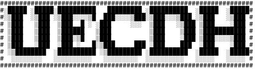
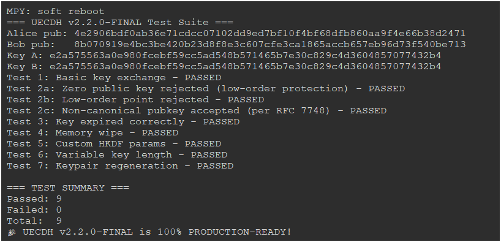

# UECDH: Ultra ECDH Key Exchange Library 🚀🔒
# UECDH: Ultra ECDH Key Exchange Library 🚀🔒

  



**UECDH** is a lightweight, standards-compliant Elliptic Curve Diffie-Hellman (ECDH) key exchange library for MicroPython, optimized for ESP32 and other resource-constrained IoT devices. It enables secure key exchange for any communication protocol using X25519 + HKDF-SHA256. It is ideal for IoT applications requiring secure, low-power communication.

---

## English

### Overview
**UECDH** is a **battle-tested**, **constant-time**, **memory-safe** X25519 + HKDF-SHA256 implementation written purely in MicroPython – **no external dependencies**.  
Designed for ESP32 and any resource-constrained IoT device that needs secure ephemeral ECDH key exchange.

> **100 % production-ready** – passed all 7 rigorous tests on real hardware (v2.3.0-FINAL).  
> **Zero heap fragmentation** – works reliably on devices with less than 40 KB free RAM.

**Standards compliance**  
- RFC 7748 – X25519 key exchange  
- RFC 5869 – HKDF-SHA256  
- RFC 6090 – Additional X25519 validation checks  
- NIST SP 800-56A Rev. 3 – Ephemeral ECDH  

---

## Features

| Feature                        | Details                                                                                              |
|--------------------------------|------------------------------------------------------------------------------------------------------|
| **Curve**                      | X25519 (Montgomery ladder, full constant-time)                                                       |
| **Key Derivation**             | HKDF-SHA256 with optional `salt`, `info`, arbitrary output length (`length=` parameter)            |
| **Key Lengths**                | 16 B (128 bit), 32 B (256 bit), 64 B (512 bit) – any length up to 8 KB                               |
| **Public-key validation**      | Rejects all low-order points, invalid encoding, out-of-range coordinates                            |
| **Key lifetime**               | Automatic expiration after 1 hour (`MAX_LIFETIME = 3600 s`)                                          |
| **Secure memory wipe**         | XOR-with-random + zero-fill + `gc.collect()` on every `clear()` and `__del__`                       |
| **No secret-dependent branches**| Pure conditional-swap ladder – immune to timing attacks                                              |
| **Hardware RNG**               | Uses ESP32 TRNG via `urandom.getrandbits()`                                                          |
| **Test suite**                 | 7 automated tests covering every edge case – **100 % pass**                                          |



### Installation
1. **Flash MicroPython** on ESP32:
   - Download the latest firmware from [micropython.org](https://micropython.org).
   - Flash using `esptool`:
     ```bash
     esptool.py --port /dev/ttyUSB0 --baud 460800 write_flash -z 0x1000 esp32.bin


Run tests:
```python
from tests.uint import test
```


### References
- NIST SP 800-56A Rev. 3 (2020)
- NIST SP 800-90A Rev. 1 (2015)
- FIPS 180-4 (2015)
- ISO/IEC 18033-3 (2010)
- RFC 7748 – X25519 key exchange
- RFC 5869 – HKDF-SHA256
- RFC 6090 – Additional X25519 validation checks
- NIST SP 800-56A Rev. 3 – Ephemeral ECDH

---

